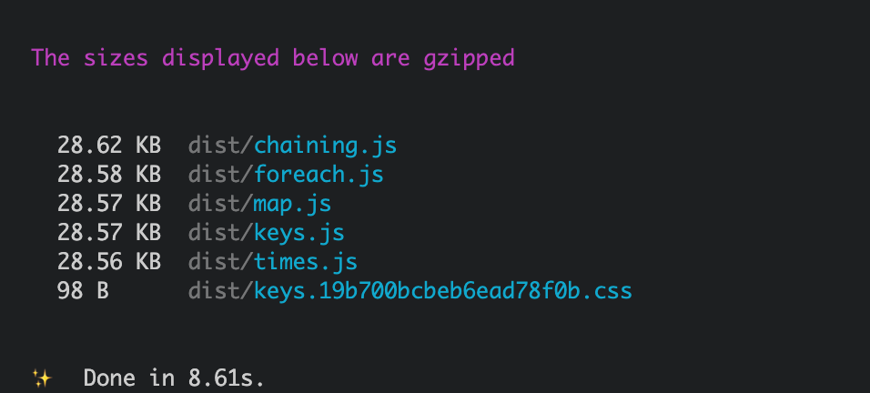
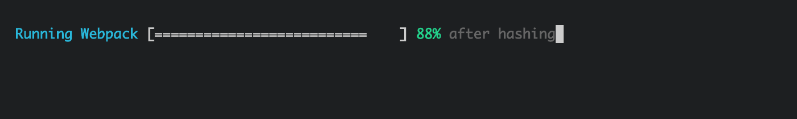

This plugin is intended to provide cleaner output of webpack build. It also displays a progress bar while the build is running.



### Progress bar

The plugin also comes with a progress bar



### Usage

In th webpack config file, add this plugin and make sure to turn off the stats

```js
const WebpackStatsProgress = require("webpack-stats-progress");

module.exports = {
  mode: "production",
  stats: "none",
  plugins: [
    new WebpackStatsProgress({ buildFolder: path.join(__dirname, "dist") }),
  ],
};
```

Check the example in the `example` folder.

### Credits:

- <a href="https://github.com/facebook/create-react-app">React Create App</a>
- <a href="https://github.com/visionmedia/node-progress">Node Progress</a>
